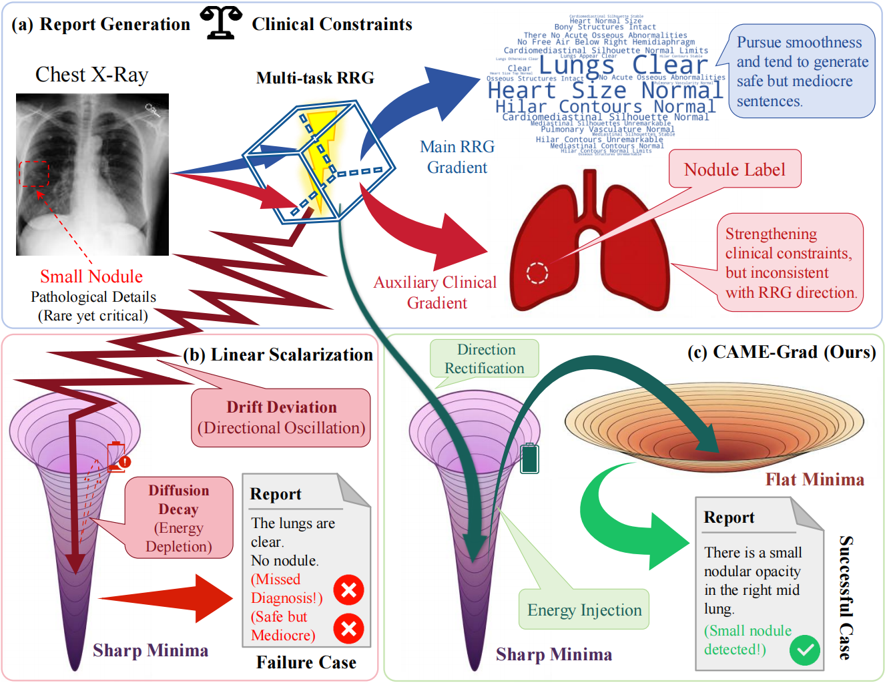

<div align="center">

<h1>[ICML'26] The Double Dilemma in Multi-Task Radiology Report Generation: A Gradient Dynamics Analysis and Solution</h1>

<p>
  Erjian Zhang<sup>1</sup> &nbsp;&nbsp;&nbsp;&nbsp; 
  Yatong Hao<sup>1</sup> &nbsp;&nbsp;&nbsp;&nbsp; 
  <a href="https://it.xju.edu.cn/info/1155/3270.htm">Liejun Wang</a><sup>1 2</sup> &nbsp;&nbsp;&nbsp;&nbsp; 
  <a href="https://it.xju.edu.cn/info/1156/3109.htm">Zhiqing Guo</a><sup>1 2</sup>
</p>

<p>
  <sup>1</sup>School of Computer Science and Technology, Xinjiang University, Urumqi, China<br>
  <sup>2</sup>Xinjiang Multimodal Intelligent Processing and Information Security Engineering Technology Research Center, Urumqi, China
</p>

<p>
  <a href="https://arxiv.org/abs/2605.22635"></a>
  <!-- <a href="https://github.com/vpsg-research/CAME-Grad"></a> -->
</p>
</div>


<div align="center">


</div>


## 🎈 News

- [2026.05] Our paper has been accepted by the **Forty-third International Conference on Machine Learning (ICML 2026)**! 🎉

## 📝 TODO

- [x] Provide detailed evaluation instructions and baseline reproduction setups for the IU X-Ray and MIMIC-CXR datasets.
- [ ] Release the corresponding model weights.
- [ ] Release the complete PyTorch codebase and algorithmic details of CAME-Grad. *(Due to ongoing follow-up research, the core optimizer source code is temporarily withheld. We will fully open-source it upon the completion of our subsequent work. Stay tuned!)*

## ⭐ Abstract

While multi-task learning based automatic radiology report generation (RRG) is widely adopted to ensure clinical consistency, most focus on architectural designs yet remain limited to coarse linear scalarization strategies. These strategies cannot effectively balance the hard constraints of discriminative clinical supervision with the smoothness requirements of report generation. To address these problems, we analyze the failure mechanism of linear scalarization from the perspective of gradient dynamics, utilizing the stochastic differential equation (SDE) framework to characterize it as a "Double Dilemma" of drift term deviation and diffusion term decay. Based on this, we propose a backbone-agnostic optimizer named **C**onflict-**A**verse **M**agnitude-**E**nhanced **Grad**ient Descent (CAME-Grad). Through conflict-averse direction rectification and magnitude-enhanced energy injection, the algorithm not only ensures geometric validity, but also avoids local optimal solutions. Then, the adaptive gradient fusion mechanism is used to establish a dynamic balance between the theoretical optimal direction and the task-specific inductive bias. Experiments show that as a universal plug-and-play optimizer, CAME-Grad brings substantial and consistent improvements across eight diverse RRG methods, elevating overall clinical efficacy performance by an average of 2.3\% on MIMIC-CXR and 1.9\% on IU X-Ray.

## 🚀 Introduction

<p align="center">
  
</p>

- **The "Double Dilemma" in RRG multi-task optimization.** **(a)** In multi-task RRG, there is an intrinsic conflict between report generation and clinical constraints. **(b)** Under linear scalarization, this conflict simultaneously induces drift term deviation and diffusion term decay.

- **Resolution via CAME-Grad.** **(c)** CAME-Grad employs direction rectification to ensure geometric validity and energy injection to escape sharp minima.

## Getting Started

### 1. Install Environment

```bash
conda create -n came_grad python=3.8
conda activate came_grad
pip install -r requirements.txt
```

### 2. Data Preparation

We use two standard datasets: **MIMIC-CXR** and **IU X-Ray**.

- **MIMIC-CXR**: Please request access from [PhysioNet](https://physionet.org/content/mimic-cxr/2.0.0/).
- **IU X-Ray**: Available from [OpenI](https://openi.nlm.nih.gov/).

### 3. Directory Structure

Please organize your data as follows:

```
data
├── mimic_cxr
│   ├── images               # Raw images
│   ├── annotation.json      # Original annotations
│   └── mimic_cxr.json       # Preprocessed for this codebase
├── iu_xray
│   ├── images
│   └── annotation.json
└── ...
```

## Training

You can train the model using `main_train.py`. The **CAME-Grad** optimizer is enabled via the `--use_came_grad` flag.

### Training with CAME-Grad (Ours)

```bash
python main_train.py \
    --dataset_name mimic_cxr \
    --image_dir data/mimic_cxr/images/ \
    --ann_path data/mimic_cxr/mimic_cxr_ddatr.json \
    --batch_size 16 \
    --save_dir results/mimic_cxr_came_grad \
    --cls_weight 4.0 \
    --use_came_grad \
    --came_rho 0.5 \
    --came_kappa 1.5 \
    --came_nu 0.2 
```

### Training Baseline (Linear Scalarization)

```bash
python main_train.py \
    --dataset_name mimic_cxr \
    --image_dir data/mimic_cxr/images/ \
    --ann_path data/mimic_cxr/mimic_cxr_ddatr.json \
    --batch_size 16 \
    --save_dir results/mimic_cxr_baseline \
    --cls_weight 4.0
```

## Evaluation

To evaluate the trained model on the test set, run `main_test.py`:

```bash
python main_test.py \
    --dataset_name mimic_cxr \
    --image_dir data/mimic_cxr/images/ \
    --ann_path data/mimic_cxr/mimic_cxr_ddatr.json \
    --load_pretrained results/mimic_cxr_came_grad/model_best.pth \
    --batch_size 32
```

## License

This project is licensed under the Apache-2.0 License.
